# 🏃‍♀️ RunBuddy  
### A Personal Running Coach for Beginner Runners

RunBuddy is a mobile application designed to guide beginner runners from their first steps to confidently completing 5 km, and later progressing toward 10 km.  
With structured training plan, GPS tracking, voice guidance, and personalized distance recommendations, RunBuddy helps users turn running into a sustainable daily habit.

## 🛠 Tech Stack

- **React Native** – Cross-platform mobile development  
- **Expo** – Framework and tooling for React Native  
- **.NET** – Backend API  
- **Entity Framework** – Database ORM  
- **SQLite** – Local data storage  
- **ML.NET** – Personalized training recommendations  

## ✨ Key Features

### Beginner-Friendly Training Plans
- Couch to 5K program  
- Personalized progression toward 10K  

### Guided Running
- Run/walk intervals  
- Voice guidance  
- Real-time GPS-based distance, pace, and time tracking  

### Statistics & Insights
- Weekly, monthly and yearly summaries  
- Detailed run history  

### Community Features
- Friends and activity feed  
- Weekly challenges 

## 📱 Application Screens


### Welcome & Authentication

<table align="center">
  <tr>
    <td>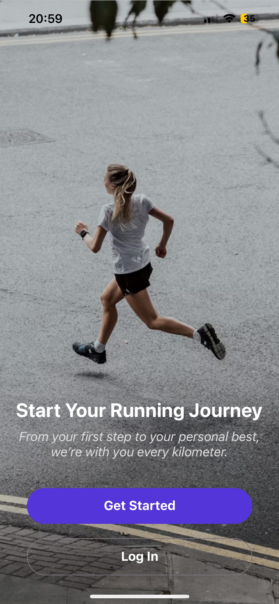</td>
    <td>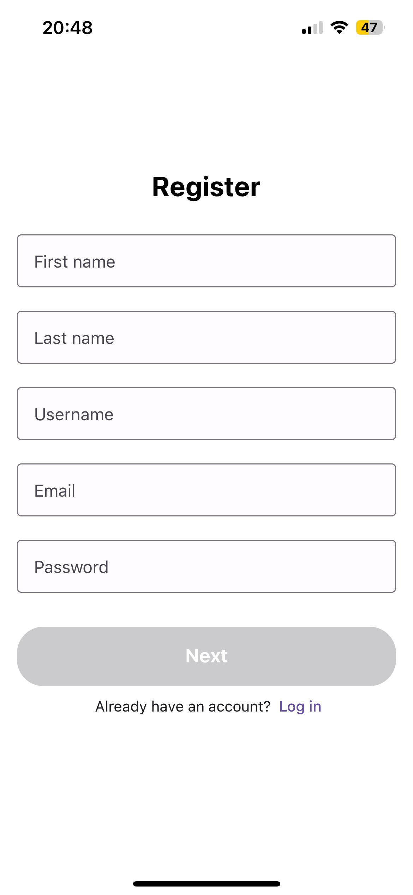</td>
    <td>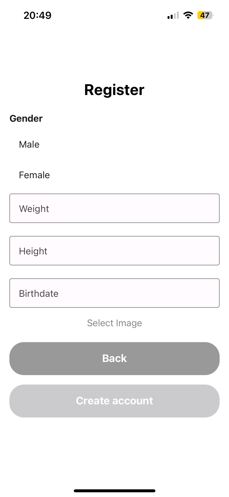</td>
    <td>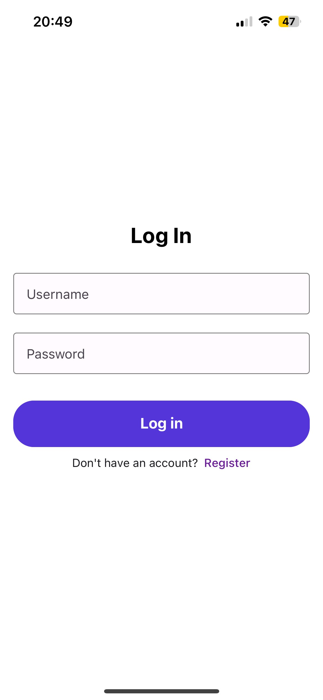</td>
  </tr>
</table>

- Motivational welcome screen introducing the application  
- Multi-step user registration  
- Secure user login  


### Home

<table align="center">
  <tr>
    <td>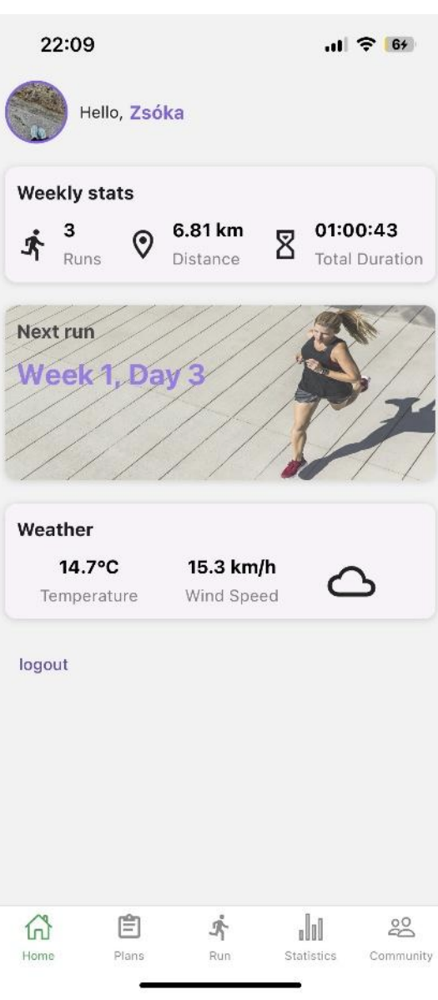</td>
  </tr>
</table>

- Weekly statistics overview  
- Next recommended training session  
- Weather information based on user location (OpenMeteo API)  


### Plans

<table align="center">
  <tr>
    <td>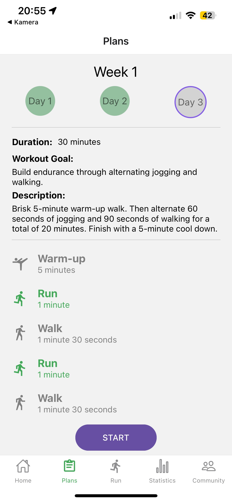</td>
  </tr>
</table>

- Full training plan overview (organized by weeks and sessions)  
- Completed trainings visually highlighted  
- Detailed information for upcoming runs  


### Run Mode Selection

<table align="center">
  <tr>
    <td>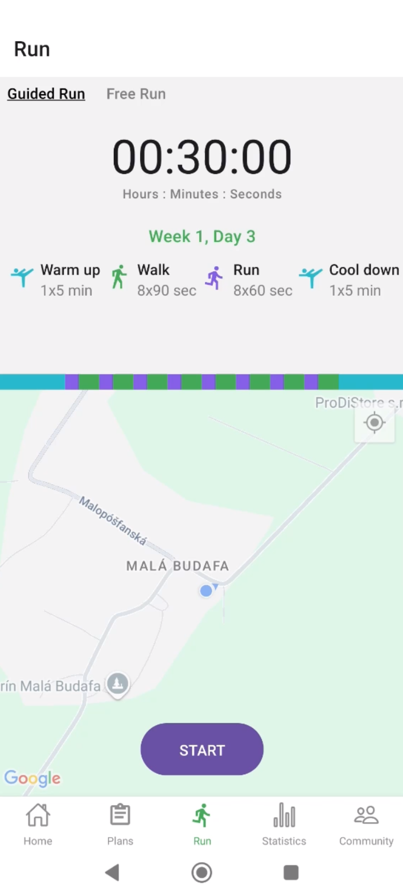</td>
    <td>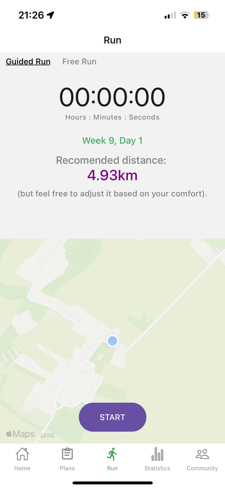</td>
    <td>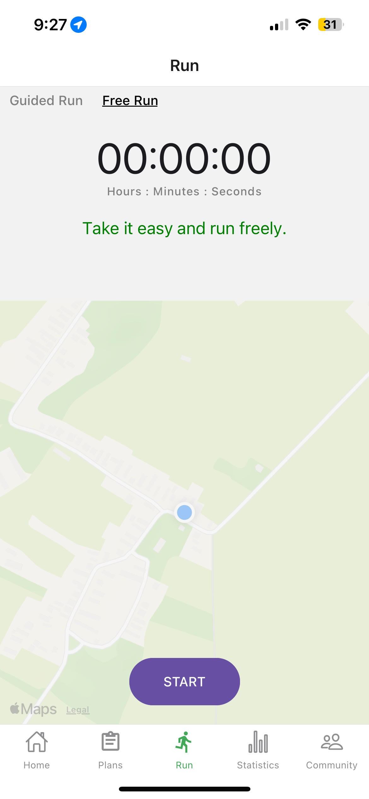</td>
  </tr>
</table>

- Choice between **plan-based run** and **free run**

**Training Plan–Based Run (5K Plan)**
- Scheduled training session display  
- Warm-up, run, and walk intervals  
- Visual progress indicator  
- Target distance and duration  

**Predicted Run (10K Plan)**
- Distance recommendation based on previous sessions  
- Performance-based progression using machine learning  

**Free Run**
- Manual start of an unstructured run  
- No predefined distance or intervals  


### Active Run

<table align="center">
  <tr>
    <td></td>
  </tr>
</table>

- Remaining time and distance display  
- Real-time GPS tracking  
- Current pace monitoring  
- Automatic run/walk voice guidance  


### Run Summary

<table align="center">
  <tr>
    <td>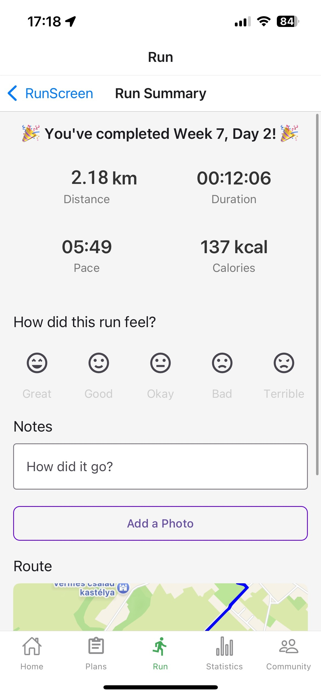</td>
  </tr>
</table>

- Distance, time, average pace, and calories burned  
- GPS-based route map  
- Run quality rating  
- Notes and photo attachments  


### Statistics

<table align="center">
  <tr>
    <td>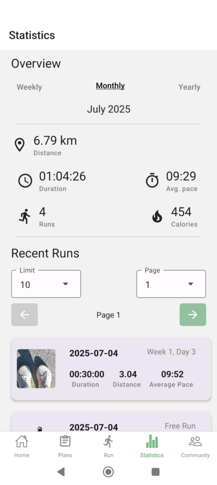</td>
  </tr>
</table>

- Aggregated running data  
- Weekly and monthly summaries  
- Detailed run history  


### Run Details

<table align="center">
  <tr>
    <td>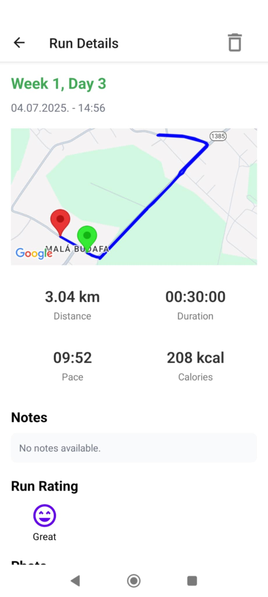</td>
    <td>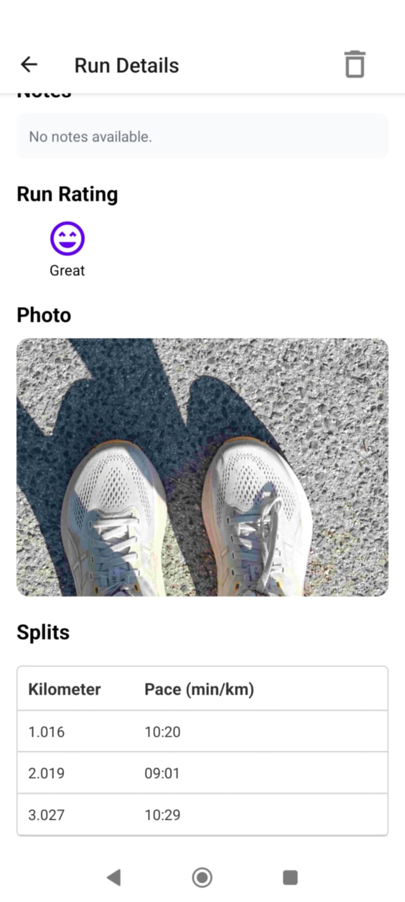</td>
  </tr>
</table>

- Full run data overview  
- Detailed route visualization with start and end markers  
- Pace breakdown  
- Notes, photos, and user rating  


### Community

<table align="center">
  <tr>
    <td>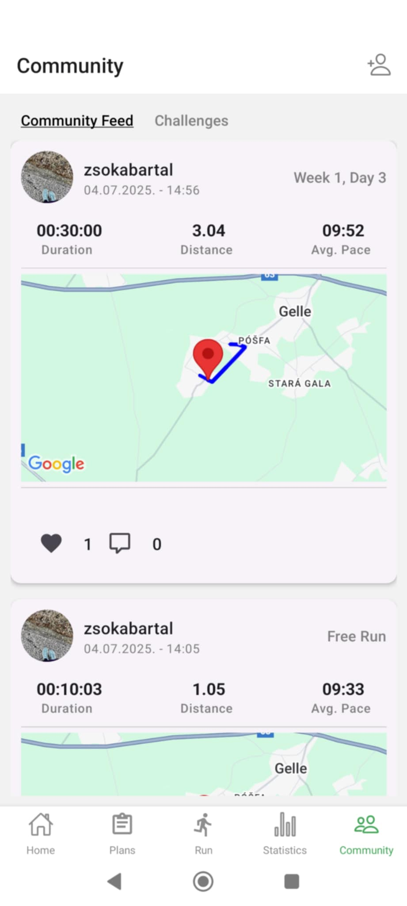</td>
  </tr>
</table>

- Activity feed with shared runs  
- Like and comment interactions  


### Challenges

<table align="center">
  <tr>
    <td>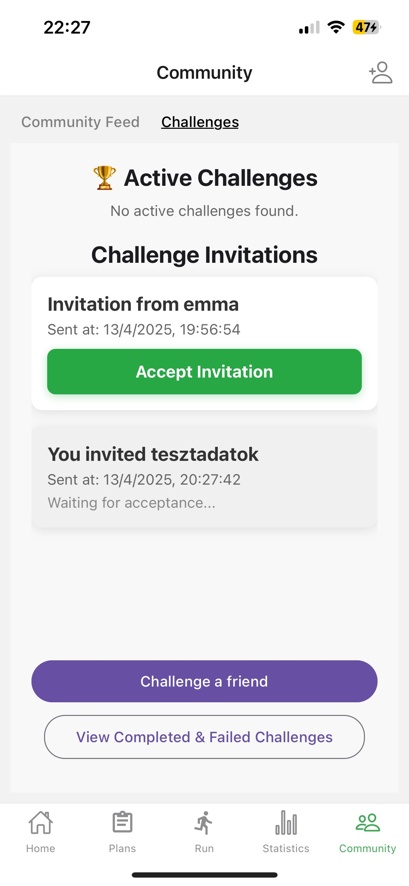</td>
    <td>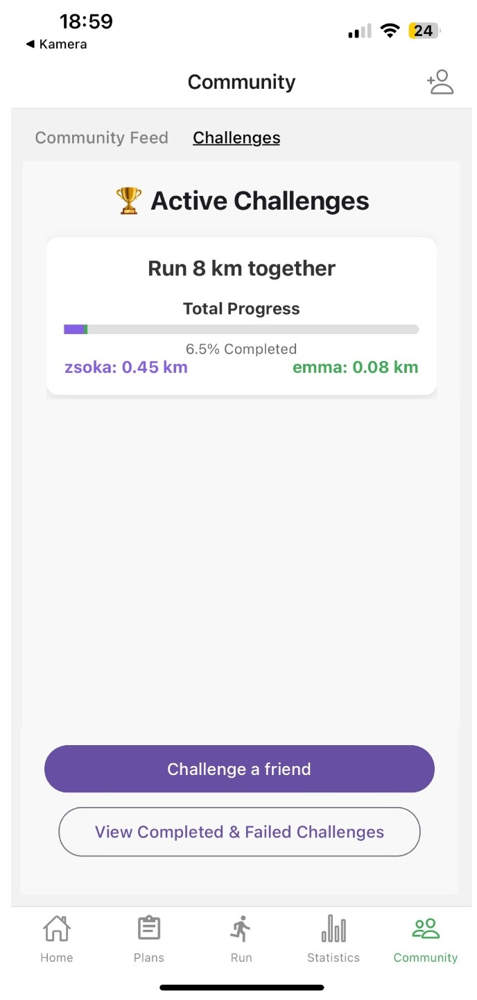</td>
  </tr>
</table>

- Weekly running challenges with friends  
- Visual progress comparison  


### User Search

<table align="center">
  <tr>
    <td>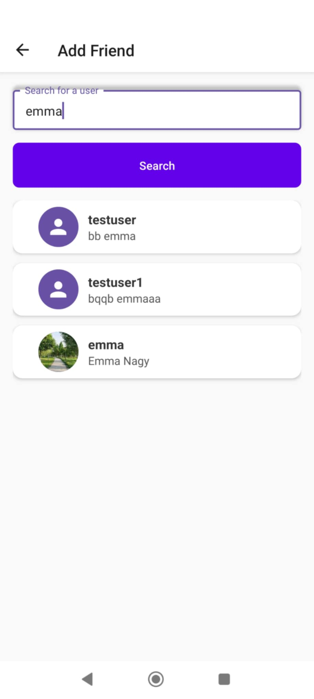</td>
    <td>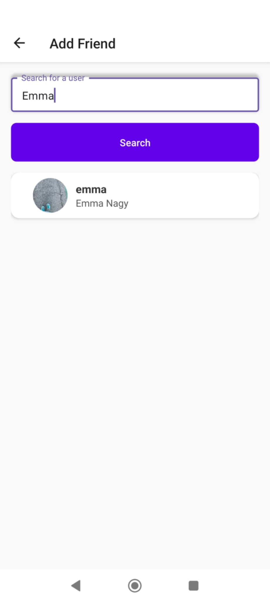</td>
  </tr>
</table>

- Search for other users  
- Follow and connect with friends  


### Profile

<table align="center">
  <tr>
    <td>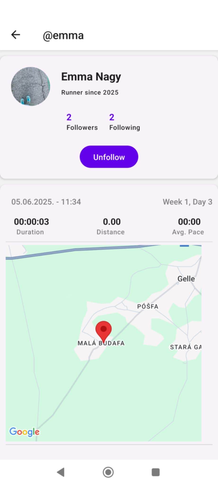</td>
    <td>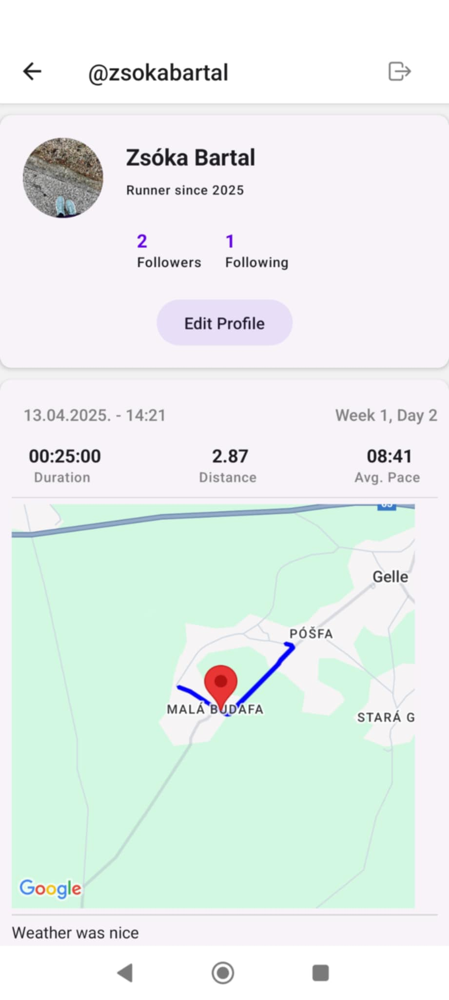</td>
    <td>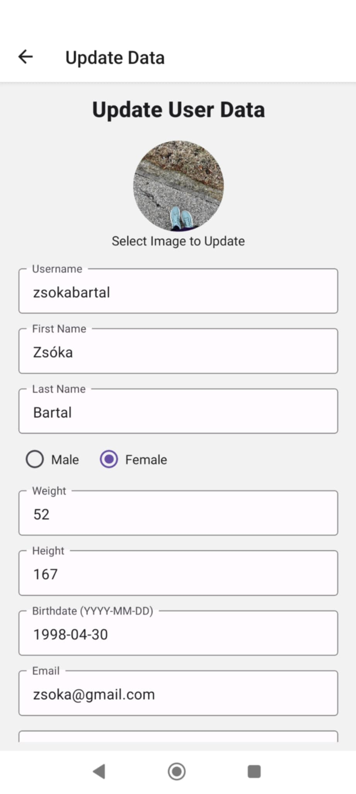</td>
  </tr>
</table>

- User profile overview  
- Personal statistics display  
- Profile and account data editing  

---

## Setup
A React Native (Expo) app with a .NET backend, using **ngrok** for HTTPS.

### Backend (.NET)
```bash
cd backend
dotnet restore
dotnet run
```
The API runs at http://localhost:7073.

### Frontend (React Native / Expo)
```bash
cd frontend
npm install   # or yarn install
npx expo start
```
Open the app in a simulator, emulator, or on your device via Expo Go.

### Ngrok Setup

Start ngrok to expose the backend:
```bash
ngrok https 7073
```

Copy the HTTPS URL and update the frontend config:
```bash
// frontend/utils/config.js
export const config = {
  baseURL: "https://abc123.ngrok.io",
};
```


Save and restart the Expo app to use the new URL.
